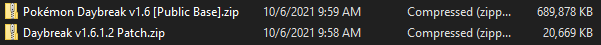
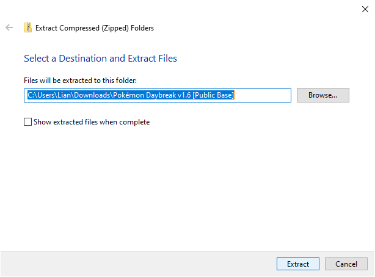
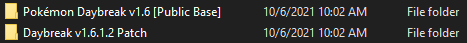
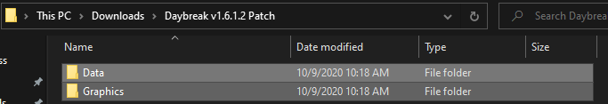
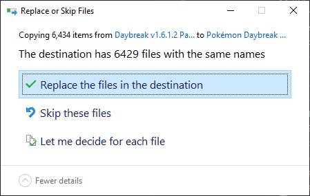
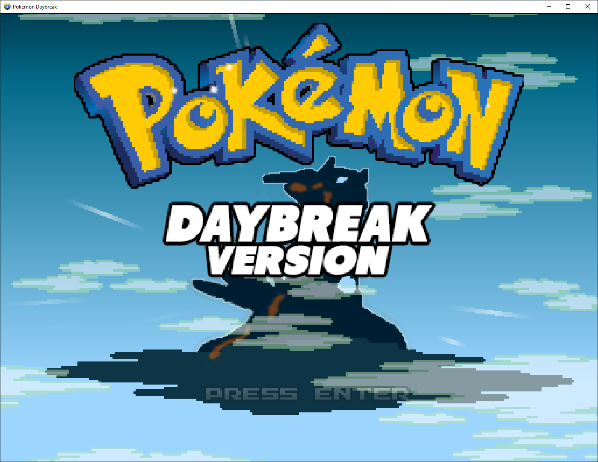

# How to install Pokémon Daybreak on Windows 10

This simple guide will contain step-by-step instructions to be able to download and play the fanmade videogame [*Pokémon Daybreak*](https://reliccastle.com/threads/2612/).

> These instructions were written on October 6th, 2021. At the moment of writing this, the pertaining file versions are:
>
> * [Base Game](https://www.mediafire.com/file/p0zv9l0bp26cmem/Pok%25C3%25A9mon_Daybreak_v1.6_%255BPublic_Base%255D.zip/file) `v1.6` *[Original Release]*
>
> * [Patch](https://www.mediafire.com/file/dgjuj9pvh7oehor/Daybreak_v1.6.1.2_Patch.zip/file) `v1.6.1.2` *[Updated October 9th, 2020]*

*Note: I do not own any of the files, images, or media shown in this tutorial. All credit goes to their respective owners.*

## Downloading the Base Game + Patch

First, make sure to download the files for the [**Base Game**](https://www.mediafire.com/file/p0zv9l0bp26cmem/Pok%25C3%25A9mon_Daybreak_v1.6_%255BPublic_Base%255D.zip/file) and the [**Mandatory Patch**](https://www.mediafire.com/file/dgjuj9pvh7oehor/Daybreak_v1.6.1.2_Patch.zip/file) with these links. You should end up with these two files in your *Downloads* folder:

Now, *right-click* the Public Base zipped folder and select ***Extract All...*** to turn it into a regular folder. Make sure to click on ***Extract*** when prompted.

Repeat the same steps with the Patch zipped folder, ending up with the folder as such:

## Applying the Patch

In order to fix potentially game-breaking bugs found in the public release, you will need to install the patch mentioned before.

**Copy** the contents of the *Daybreak v1.6.1.2 Patch* folder, and paste them into the *Pokémon Daybreak v1.6 [Public Base]* folder.

When doing so, make sure to select ***Replace the files in the destination***.

If it finished copying the files after this prompt, it means it is done and the game is ready to play.

## Starting the game

Inside the *Pokémon Daybreak v1.6 [Public Base]* folder, you are going to find a file called **`Game-z.exe`**. Simply double-click on it to run the game. If everything was done correctly, the game window should appear on your screen.

## Adding the Game Launcher to the Start Menu

Because a script that automatically does this for you (which I am working on) is not finished yet, either write to me for help or I'll update this section once available.
